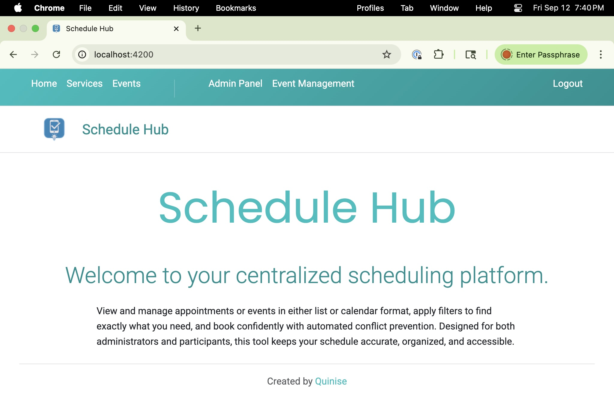
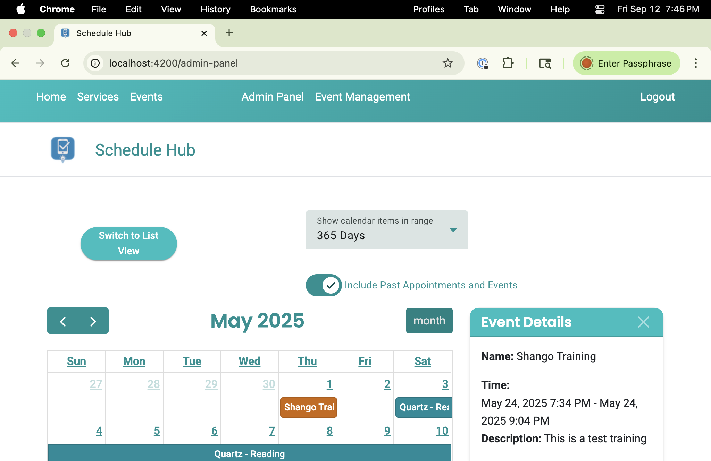
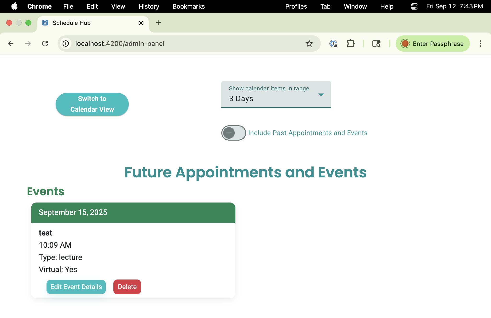

# Schedule App (Angular 19 + Spring Boot + PostgreSQL)
<p align="center">
  
</p>

[](https://opensource.org/licenses/MIT)
[](https://angular.dev/)
[](https://getbootstrap.com/)
[](https://spring.io/projects/spring-boot)


A streamlined scheduling and consultation app that makes it easy for users to book appointments and events, while giving admins powerful tools to manage calendars, avoid conflicts, and keep everything up to date. Built with a modern full-stack architecture, it provides real-time validation, role-based features, and a smooth user experience across devices.

---

## Features
- **Calendar & List Views:** FullCalendar (month grid) plus grouped list view  
- **Role-aware UI:** Admins can create/update/delete; users manage personal bookings  
- **Conflict Checking:** Prevents overlaps + pre-event buffers  
  - Virtual: 15 min  
  - In-person (Bremerton): 2.5 hrs  
  - In-person (Seattle): 45 min  
- **Validation UX:** Inline errors, disabled submit on invalid states, clear toasts/snackbars  
- **Auth:** Firebase Authentication (email/password + Google login, with sign-up restrictions configurable)

## Screenshots

| Landing Page | Calendar View | Admin Panel |
|--------------|---------------|-------------|
|  |  |  |

---

## Project Layout
khepraOnePage/   → Angular 19 frontend app (https://github.com/quinise/khepraOnePage)  
khepra-backend/  → Spring Boot backend (https://github.com/quinise/khepra-backend)

> Note: frontend and backend are maintained in separate repositories. Clone both if you need the full stack.
---

## Quick Start

### 1. Clone the repo
```bash
git clone https://github.com/quinise/khepraOnePage.git
cd khepraOnePage
```

### 2. Backend (Spring Boot + PostgreSQL)
> See Environment Variables to configure backend before running.

Create a database + user in PostgreSQL:
```sql
CREATE DATABASE schedule_app;
CREATE USER schedule_user WITH ENCRYPTED PASSWORD 'changeme';
GRANT ALL PRIVILEGES ON DATABASE schedule_app TO schedule_user;
```

Run backend:
```bash
git clone https://github.com/quinise/khepra-backend.git
cd khepra-backend
./mvnw spring-boot:run
```

Backend runs at:
- http://localhost:8080/api/appointments
- http://localhost:8080/api/events

### 3. Frontend (Angular 19)
Install dependencies & run:

```bash
cd khepraOnePage
npm install
ng serve
```
Frontend runs at:
- http://localhost:4200

## Environment Variables

### Frontend

Obtain a Firebase config from the Firebase Dashboard and add it to:
/khepraOnePage/src/firebase-config.ts

```ts
export const firebaseConfig = {
  apiKey: "xxxxxxxxxxxxxxxxxxxxxxxxx",
  authDomain: "xxxxxxxxxxxxxxxxxxxxxxxxx",
  projectId: "xxxxxxxxxxxxxxxxxxxxxxxxx",
  storageBucket: "xxxxxxxxxxxxxxxxxxxxxxxxx",
  messagingSenderId: "xxxxxxxxxxxxxxxxxxxxxxxxx",
  appId: "xxxxxxxxxxxxxxxxxxxxxxxxx",
  measurementId: "xxxxxxxxxxxxxxxxxxxxxxxxx"
};
```

### Environment file (/src/environments/environment.ts)
```ts
export const environment = {
  production: false,
  apiBase: '/api',
  useBasicAuth: true,
  apiUser: 'xxxxxxx',
  apiPass: 'xxxxxxx'
};
```

### Backend

Set environment variables (example for macOS/Linux):
```bash
export SPRING_DATASOURCE_URL=jdbc:postgresql://localhost:5432/schedule_app
export SPRING_DATASOURCE_USERNAME=schedule_user
export SPRING_DATASOURCE_PASSWORD=changeme
export SPRING_JPA_HIBERNATE_DDL_AUTO=update
```

## Prerequisites
- **Node.js**: v18.17.1
- **npm**: v9.6.7
- **Angular CLI**: 19.2.14
- **Java**: 17+
- **Maven**: 3.9+
- **PostgreSQL**: 14+ (or Docker for local DB)

## Dependencies

### Frontend 
- **FullCalendar**: 6.1.17
- **Angular Material**: 6.7.0
- **Bootstrap**: 5.3.3
- **Firebase**: 11.6.0
- **Karma**: ~6.4.0

### Backend
- Spring Boot 3.x
- PostgreSQL 14+
- Maven 3.9+
- Java 17


## Testing

### Frontend (Karma)
```bash
cd khepraOnePage
ng test
```

### Backend (JUnit + Maven)
```bash
cd khepra-backend
./mvnw test
```

## Roadmap
- [x] Conflict check (frontend + backend)
- [x] Admin create/edit/delete
- [x] Validation messages + disabled submit on invalid
- [ ] Live refresh lists after changes
- [ ] Visual confirmation on successful create/delete
- [ ] Prevent Google sign-up via config + backend check
- [ ] CI/CD pipeline with Docker → AWS

## License
This project is licensed under the MIT License. See the [LICENSE](LICENSE) file for details.
